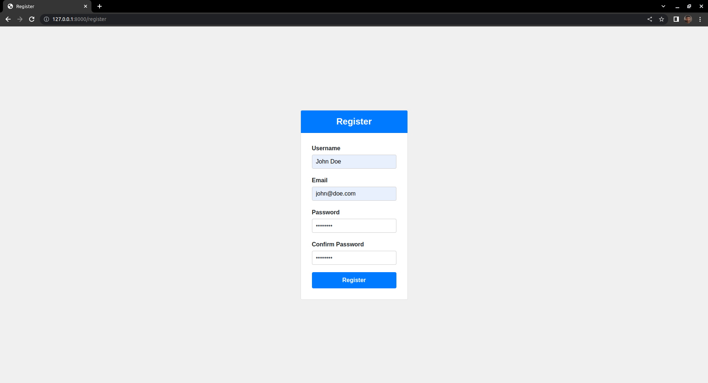

# Django Chat GPTClone - freeCodeCamp

This project is a chatbot using OpenAI API. The goal was to make a ChatGPT clone integrating the `gpt-4` model, but wasn't available, so the `gpt-3.5-turbo-0301` model was used instead. This project is taught by Tomi Tokko on the [Django ChatGPT Clone Tutorial](https://www.youtube.com/watch?v=qrZGfBBlXpk) video on [freeCodeCamp](https://www.youtube.com/@freecodecamp) Youtube channel. 

## About the project

It's a simple chatbot, working only with text. The frontend was built with HTML templates and all the CSS and JavaScript needed for it to work properly was written in style and script tags in the templates.

In this chatbot there is a register app, but you can chat with the AI without registering. If you do choose to register, you'll be able to see your chat history with the AI. Regardless of how many users are registered, you can only see your own history.

To register you need to choose an username, an email, and you need to type the same password twice. In case you mistype it an error message will be shown at your screen saying that that passwords don't match.

<!--  -->

When you're registered, you'll be redirected to the homepage, that is the chatbot itself.

<!--  -->

<!--  -->

On this page you'll see an option to logout.
If you logout, you'll be redirected to the login page.

<!--  -->

### Built with

- Django
- OpenAI
- HTML
- CSS
- JavaScript
